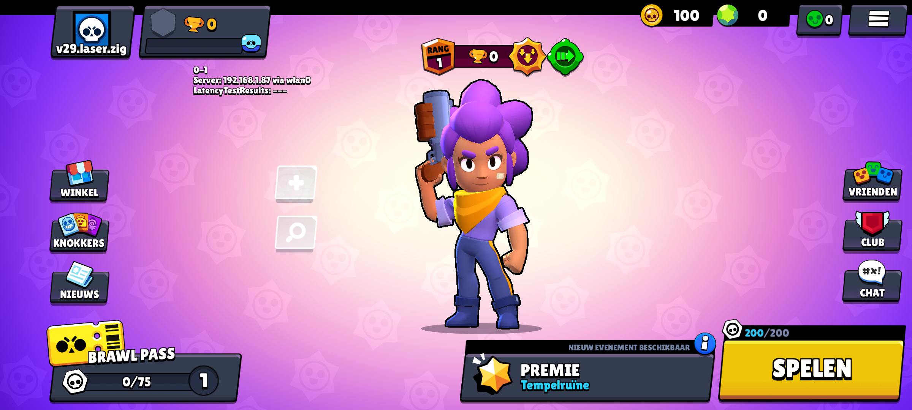

This is the Brawl Stars Core, version V29.270.1, written in Zig.

## Requirements

- Zig
- Brain..? 🧑🏿‍🦯

## Building

```bash
git clone https://github.com/FMZNkdv/FMZNkdv.Laser.V29
cd FMZNkdv.Laser.V29
```

## Running

```bash
zig run Core.zig
```

The server will start listening on `0.0.0.0:9339` by default.
